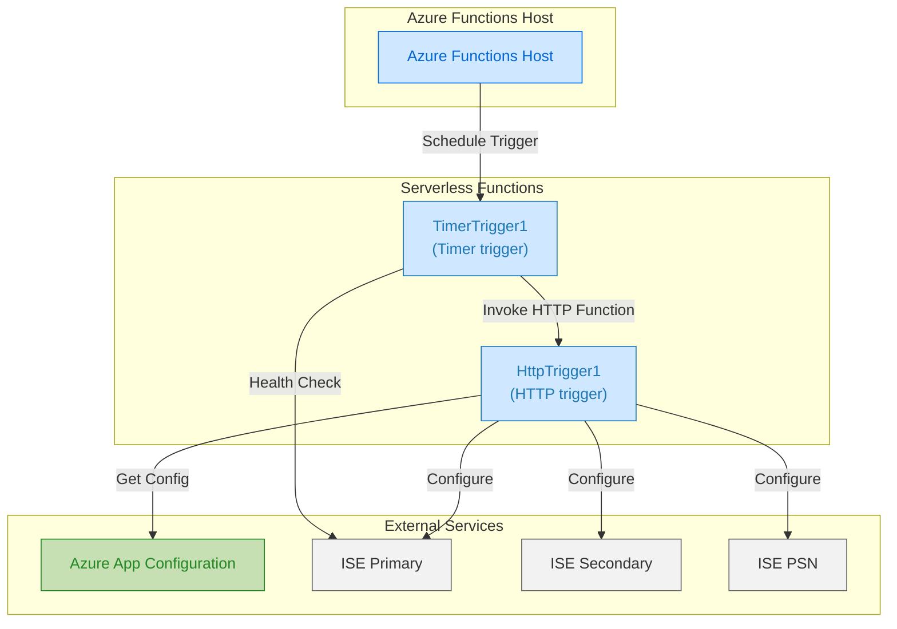

This repo contains the code for Azure function required for the configuring the Cisco ISE application nodes on the Azure cloud and contains two functions.
- Timer function - It checks the status of the Primary, Secondary and PSN ISE node and if it finds it Up and running then it triggers the second HTTP function to configure the nodes and also checks the node sync status.
- HTTP function - This function is responsible for fetching the Key-values from the azure AppConfig service and excutes the function defined in the main function to configure the ISE Primary, Secondary and PSN nodes.

---

